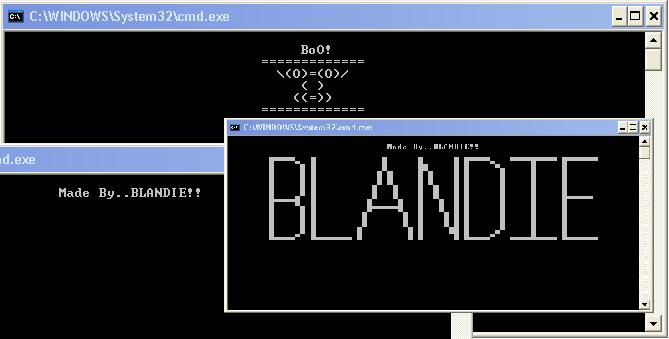



## MAKE BATCH

### Description

This program will make a batch file & run the batch file the batch will show TXTS & it will creat a Sleep.vbs to make the batch stey open for some time.The stuff what this batch makes will delete all the stuff what it makes & it will delete it self
 
### More Info
 

             |
---                |---
**Submitted On**   |2003-09-16 11:39:02
**By**             |[StuPot](https://github.com/Planet-Source-Code/PSCIndex/blob/master/ByAuthor/stupot.md)
**Level**          |Intermediate
**User Rating**    |5.0 (10 globes from 2 users)
**Compatibility**  |VB 5\.0, VB 6\.0, VB Script
**Category**       |[Complete Applications](https://github.com/Planet-Source-Code/PSCIndex/blob/master/ByCategory/complete-applications__1-27.md)
**World**          |[Visual Basic](https://github.com/Planet-Source-Code/PSCIndex/blob/master/ByWorld/visual-basic.md)
**Archive File**   |[MAKE\_BATCH1646069162003\.zip](https://github.com/Planet-Source-Code/stupot-make-batch__1-48545/archive/master.zip)

